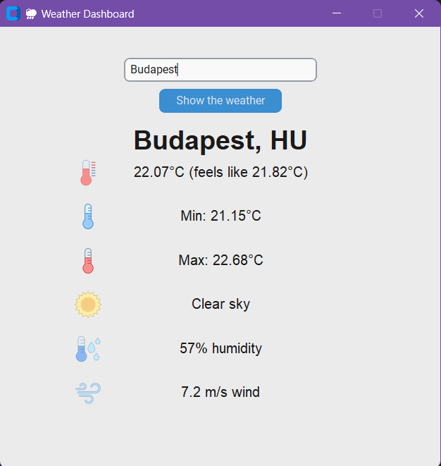

# 🌦️ Weather Dashboard

Simple weather dashboard built with **Python** and **CustomTkinter** that allows users to get real-time weather data for any city using the **OpenWeatherMap API**. The app displays weather parameter with the help of minimalistic GUI.

---

## 📸 Demo

  
*Screenshot of the app running with weather data displayed.*

---

## 🛠️ Technologies Used

- Python
- CustomTkinter – modern UI toolkit
- Pillow – for handling images
- OpenWeatherMap API – for weather data

---

## ⚙️ Setup Instructions

1. **Clone the repo:**
   ```bash
   git clone https://github.com/XXeniia/weather_app.git
   cd weather-dashboard
   ```

2. **(Optional but recommended)** Create a virtual environment:
   ```bash
   python -m venv venv
   On iOS: source venv/bin/activate  
   On Windows: venv\Scripts\activate
   ```

3. **Install dependencies:**
   ```bash
   pip install -r requirements.txt
   ```

4. **Set API key:**

   1. Get your API key from the following webpage: https://openweathermap.org/api

   2. Sign Up/Log In and go to API dashboard.

   3. Copy and paste your API key into the config.py file of the project


5. **Run the app:**
   ```bash
   python main.py
   ```


